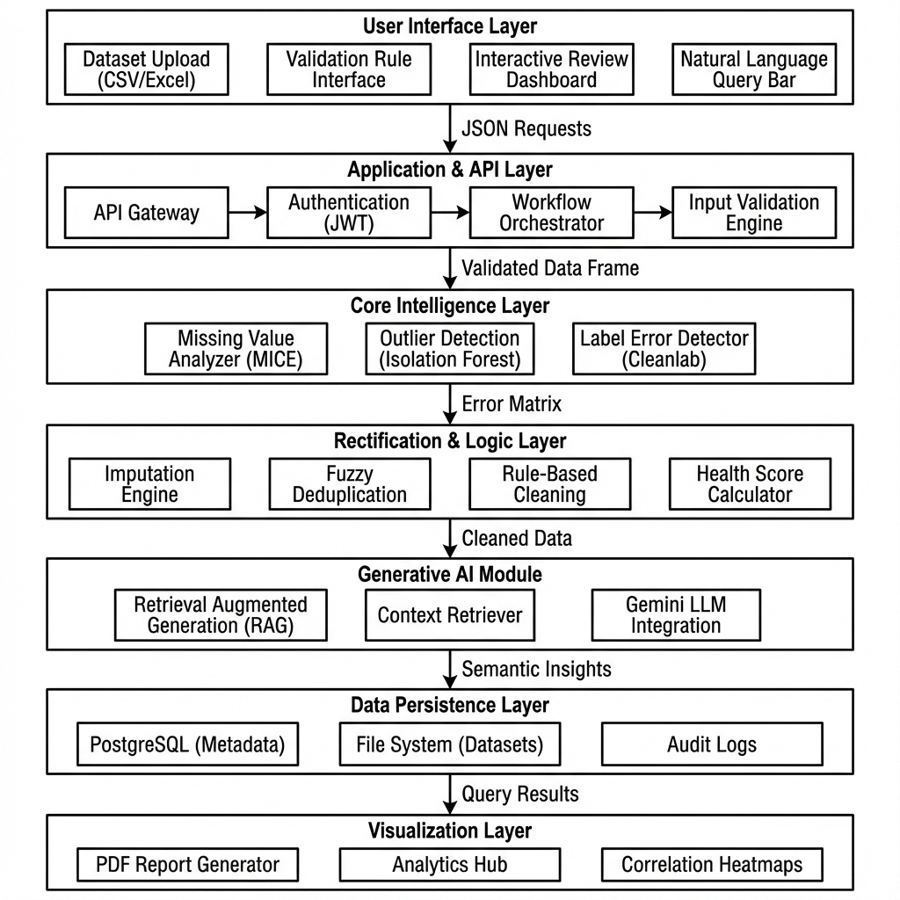

# 🚀 Intelligent Dataset Management Platform

<p align="center">
  <b>An Enterprise-Grade AI-Powered Platform for Dataset Quality Audit, Automated Cleaning, Neural Error Correction, and Executive Analytics.</b>
</p>

<p align="center">
  <a href="https://github.com/Saketh-45/Intelligent-Dataset-Management-Platform/stargazers"></a>
  <a href="https://github.com/Saketh-45/Intelligent-Dataset-Management-Platform/network/members"></a>
  <a href="https://github.com/Saketh-45/Intelligent-Dataset-Management-Platform/blob/main/LICENSE"></a>
</p>

---

## 📖 Table of Contents
- [Overview](#-overview)
- [Key Features](#-key-features)
- [System Architecture](#-system-architecture)
- [Tech Stack](#-tech-stack)
- [Getting Started](#-getting-started)
  - [Prerequisites](#prerequisites)
  - [Backend Installation](#1-backend-setup)
  - [Frontend Installation](#2-frontend-setup)
- [Environment Variables](#-environment-variables)
- [API Reference](#-api-reference)
- [License](#-license)

---

## 🌟 Overview

The **Intelligent Dataset Management Platform** addresses critical challenges in data science and enterprise AI workflows—where over 80% of time is wasted manually cleaning dirty datasets, identifying mislabeled targets, fixing inconsistent schemas, and removing statistical outliers.

Powered by **Google Gemini 1.5 Flash**, **Cleanlab Confident Learning**, and **Scikit-Learn**, this platform automates the entire dataset lifecycle: from multi-format upload and statistical error detection to interactive AI query advice, residual risk monitoring, and executive PDF reporting.

---

## ✨ Key Features

### 🧠 1. AI-Powered Data Intelligence & Natural Language Chat
* **Advisory AI Chatbot**: Query dataset statistics and column health in natural language using Google Gemini AI without exposing sensitive raw data rows.
* **Smart Cleaning Suggestions**: Automated LLM analysis of dataset distributions proposing actionable cleaning rules.
* **Semantic Error Correction**: Deep neural audit standardizing ambiguous values (e.g. `NYC`, `New York City` $\rightarrow$ `New York`).
* **Narrative Executive Summaries**: One-click AI generation of high-level audit summaries for executive reports.

### 🔍 2. Advanced Error & Anomaly Detection
* **Cleanlab Label Quality Audit**: Detect mislabeled targets using confident learning algorithms.
* **Multivariate Outlier Profiling**: Z-score and Interquartile Range (IQR) detection.
* **Duplicate & Imputation Engine**: Automated handling of missing values (Mean, Median, Mode, Drop) and row duplication.

### 📊 3. Interactive Analytics & Executive Reports
* **Analytics Hub**: Dynamic Chart.js visualization of missing data ratios, distribution histograms, and data health scores.
* **One-Click PDF Export**: Download sleek, client-ready data quality reports powered by `html2canvas` and `jsPDF`.
* **Guided Cleaning Wizard**: Step-by-step wizard recommending optimal operations based on dataset characteristics.

### 🛡️ 4. Enterprise Governance & Version Control
* **Dataset Version Timeline**: Track dataset modifications across time with instant rollback capabilities.
* **Residual Risk Monitor**: Real-time risk indicator tracking post-cleaning compliance.
* **Audit Log Board**: Comprehensive log of operations, users, timestamps, and row transformation deltas.
* **JWT Authentication & RBAC**: Secure user registration, authentication, and session handling.

---

## 🏗️ System Architecture

<p align="center">
  
</p>

```
[ Frontend: React + Vite + Bootstrap ]
              │ (HTTP / REST API - JSON)
              ▼
 [ Backend: Flask / Python 3.9+ ]
    ├── Authentication (JWT Extended)
    ├── Data Processor (Pandas, Scikit-Learn, Cleanlab)
    ├── AI Engine (Google Gemini 1.5 Flash)
    └── Database Layer (PostgreSQL Metadata + Local File Storage)
```

---

## 🛠️ Tech Stack

| Layer | Technologies & Tools |
|---|---|
| **Frontend** | React 18, Vite, Bootstrap 5, Chart.js, React Router, Lucide Icons, Axios |
| **Backend** | Python 3.9+, Flask, Flask-SQLAlchemy, Flask-JWT-Extended, Pandas, NumPy |
| **AI / ML** | Google Gemini API (`google-generativeai`), Cleanlab, Scikit-Learn |
| **Database** | PostgreSQL (Production Metadata) / SQLite (Dev) |
| **Export Tools**| `jsPDF`, `html2canvas`, `xlsx` |

---

## 🚀 Getting Started

### Prerequisites
Make sure you have the following installed on your local machine:
* **Node.js** (v18.0.0 or higher)
* **Python** (v3.9 or higher)
* **PostgreSQL** (Optional for local development; SQLite works out-of-the-box)

---

### 1. Backend Setup

```bash
# 1. Navigate to the backend directory
cd backend

# 2. Create and activate a virtual environment
python -m venv venv
# On Windows:
venv\Scripts\activate
# On macOS/Linux:
source venv/bin/activate

# 3. Install Python dependencies
pip install -r requirements.txt

# 4. Create your local .env file
echo GEMINI_API_KEY=your_google_gemini_api_key > .env
echo JWT_SECRET_KEY=supersecretjwtkey >> .env

# 5. Launch the Flask API server
python app.py
```
> The backend server will run on `http://127.0.0.1:5000`.

---

### 2. Frontend Setup

```bash
# 1. Open a new terminal and navigate to frontend
cd frontend

# 2. Install Node dependencies
npm install

# 3. Start Vite dev server
npm run dev
```
> The frontend application will open on `http://localhost:5173`.

---

## ⚙️ Environment Variables

Create a `.env` file inside the `backend/` directory:

| Variable | Description | Default |
|---|---|---|
| `GEMINI_API_KEY` | Google Gemini API Key for AI features | *(Optional for simulation mode)* |
| `JWT_SECRET_KEY` | Secret key for signing authentication tokens | `jwt_super_secret_key` |
| `DATABASE_URL` | PostgreSQL connection string | `sqlite:///dataset_platform.db` |
| `SECRET_KEY` | Flask application secret key | `dev_secret_key_12345` |

---

## 📡 API Reference

| Endpoint | Method | Description |
|---|---|---|
| `/api/auth/register` | `POST` | Register a new user account |
| `/api/auth/login` | `POST` | Authenticate user and receive JWT token |
| `/api/datasets/upload` | `POST` | Upload CSV / Excel dataset |
| `/api/datasets` | `GET` | List all user datasets & metadata |
| `/api/datasets/<id>/clean` | `POST` | Apply custom cleaning pipeline & create new version |
| `/api/datasets/version/<id>/chat` | `POST` | Natural language advisory chat with Gemini AI |
| `/api/datasets/version/<id>/audit-log` | `GET` | Fetch transformation audit logs for a version |

---

## 📜 License

Distributed under the **MIT License**. See [`LICENSE`](./LICENSE) for more details.

<p align="center">
  Made with ❤️ by <a href="https://github.com/Saketh-45">Saketh-45</a>
</p>
